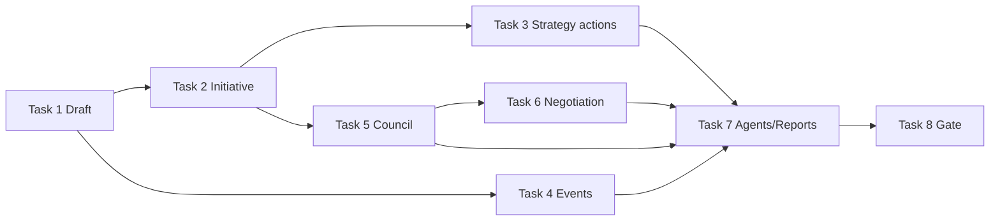

# Agent Playtest Simulation — Milestone 2: Strategy, Council & Events

> **For agentic workers:** Use `agents/checklists/Canon_Change_Checklist.md` when promoting any PROPOSED rule to canon. Steps use checkbox (`- [ ]`) syntax for tracking.

**Date:** 2026-07-03  
**Status:** PROPOSED implementation plan — does not change canon until playtested and logged in `rules_and_systems/INDEX.md`.  
**Goal:** Encode the politics/tempo layer so the sim exercises First Playable's Strategy draft, initiative-driven Action Phase, High Council procedure, and a minimal Event phase. Unlock Diplomat persona behavior and VP-ordered catch-up.

**Architecture:** Extends M1 per `docs/plans/2026-07-02-agent-playtest-simulation-design.md` §5 milestone 2. Engine remains authoritative; agents only choose legal actions. M1 combat/economy/objectives stay on.

**Prerequisites:** M1 gate closed; ambiguity ledger resolved (`playtest/Ambiguity_Ledger.md`). Plan 1/2 regression brackets green in CI (`sim/configs/regression-*.json`).

**Working directory:** Repo root. Pytest from `sim/`.

**Canon inputs:** `Round_Structure.md` (phase order), `Strategy.md`, `High_Council.md`, `Events.md` (global subset), `Diplomacy.md` (binding deals), `playtest/First_Playable_Packet.md` §4.3 (8 Strategy cards on).

---

## M2 gate (definition of done)

- [ ] **100 consecutive** `completed` persona-bot games at **4p** with **zero** `crashed` / invariant failures.
- [ ] Strategy draft runs every round (VP-ordered; bounty gold on undrafted cards).
- [ ] Action Phase turn order follows **lowest Strategy card initiative**, not seating order.
- [ ] High Council resolves **≥1 agenda item** per round (8-card First Playable agenda deck).
- [ ] Event phase resolves **≥1 global event** every **3 rounds** (reduced deck for sim).
- [ ] `playtest/Ambiguity_Ledger.md` updated for any new engine interpretations.
- [ ] Persona **Diplomat** win rate >0% in mixed 4p bracket (smoke — not parity target).
- [ ] Golden replays regenerated; pytest ≥ current count + M2 chapter tests.

---

## File structure (target)

```
sim/aeonis_sim/
  engine/
    strategy.py       # 8-card deck, draft, initiative, primaries/secondaries (subset)
    council.py        # Speaker, agenda deck, motions, votes, decrees/laws/titles
    events.py         # Global event deck (First Playable subset), resolve at Event phase
    negotiation.py    # Typed offers (binding resources/votes); engine-enforced
    game.py           # Wire phases; remove M1 stubs
  agents/
    features.py       # council_leverage, strategy_value, influence features
    persona.py        # Diplomat weights use council features
  reports/
    summary.py        # council_pass_rate, strategy_pick_distribution
sim/configs/
  bracket-m2-smoke.json
  bracket-m2-4p.json
tests/
  test_strategy.py
  test_council.py
  test_events.py
  test_m2_smoke.py
```

---

## Task 1: Strategy card model & draft phase

**Files:** `sim/aeonis_sim/engine/strategy.py`, modify `game.py`

- [x] `STRATEGY_CARDS` — 8 canon cards from `Strategy.md` §3 (id, initiative, primary/secondary costs/effects as data).
- [x] Per-player state: `held_cards: list[str]`, `primary_used: set`, `secondary_used: set`.
- [x] `_strategy_draft(state, rng)` at Round Start / Strategy Selection window:
  - Draft order: ascending VP (tie: Renown, then Speaker clockwise).
  - 3–4p: 2 cards each (two passes); 5–8p: 1 card each.
  - Undrafted cards accumulate **1 Gold bounty** (take on draft).
- [x] `initiative_order(state) -> list[int]` — lowest card number first; 2-card holders use min number.
- [x] Tests: 4p draft order follows VP; bounty accumulates; 3–4p get 2 cards.

**M2 simplification (document in module docstring):** Primaries that reference Arcane Tier II+ resolve as "gain resources only" until M3. Emergency council from Diplomatic Decree deferred to Task 3.

---

## Task 2: Initiative-driven Action Phase

**Files:** modify `game.py`, `observations.py`

- [x] Replace seating-order `_active_pid` with initiative queue from `strategy.initiative_order`.
- [x] After a player passes, they leave the queue for this round; when empty → Production.
- [x] `DecisionPoint` includes `phase` field (`action`, `strategy_primary`, `council_vote`, …).
- [x] Tests: player with Strategy card 1 acts before card 8; passing removes player from queue.

---

## Task 3: Strategy primary & secondary actions (minimal)

**Files:** `strategy.py`, `actions` integration

- [x] `enumerate_strategy_actions(state, pid)` — legal primaries for held cards not yet used.
- [x] Implement **high-value subset** first (balance-critical):
  - Resource Surge (0 AP resources)
  - Military Maneuvers (discount move/attack)
  - Economic Boom (+5 Gold; plan "Consolidation of Power" alias)
- [x] `enumerate_secondaries(state, pid, triggering_card)` after primary resolves.
- [x] Bot scoring: persona weights for strategy picks at draft + primary use.
- [x] Tests: Resource Surge grants gold/mana/influence; secondary opt-in once per card per round.

**Defer to M2.1:** Arcane Ascendancy free research, Diplomatic Decree emergency council, full secondary menu.

---

## Task 4: Event phase (global subset)

**Files:** `sim/aeonis_sim/engine/events.py`, modify `game.py`

- [x] First Playable global event deck (6–8 cards from `First_Playable_Packet.md` / `Events.md`).
- [x] At Event phase (before Strategy): reveal top card, apply effect, discard.
- [x] Effects as typed handlers: resource grant, unit spawn neutral, VPless tempo (AP ±1 this round).
- [x] Tests: event fires before strategy draft; deck cycles; no crash on empty deck.

---

## Task 5: High Council phase

**Files:** `sim/aeonis_sim/engine/council.py`, modify `game.py`

- [x] State: `speaker: int`, `agenda_deck`, `agenda_revealed` (1–2 items/round per First Playable).
- [x] Procedure per `High_Council.md` §3 (simplified):
  - Reveal agenda card(s).
  - Proposal window: bots auto-propose agenda item or pass.
  - Vote: base 1 + Renown tiers; optional Influence lobby (2 Influence = +1 vote).
  - Resolve passed motion (decree/law/title from card text).
- [x] Speaker passes clockwise at Cleanup (already in cleanup — wire token).
- [x] Tests: speaker rotates; motion passes with majority; failed motion discarded.

**M2 simplification:** Player-authored custom motions deferred; bots vote on agenda cards only. Contested adjacency Influence bids use council lobby math (replaces AL-14 sim-only neutral tie).

---

## Task 6: Structured negotiation (minimal)

**Files:** `sim/aeonis_sim/engine/negotiation.py`

- [ ] `Offer` type: gives/gets resources, vote commitment on named motion.
- [ ] Flow: propose → accept | reject | one counter → closed (per design spec §6).
- [ ] Binding transfers execute in engine; track non-binding promises for metrics.
- [ ] Persona bots evaluate offers via dot-product on persona weights.
- [ ] Tests: resource trade executes; illegal offer rejected.

**Window:** Council negotiation + Trade action only (per `Diplomacy.md` binding deals).

---

## Task 7: Agent & report updates

**Files:** `agents/features.py`, `agents/persona.py`, `reports/summary.py`, `reports/hypotheses.py`

- [ ] Features: `influence`, `council_votes`, `strategy_initiative`, `bounty_gold`.
- [ ] Diplomat persona: weight council/influence features > military.
- [ ] Reports: `council_pass_rate`, `motions_proposed`, `avg_influence_spent`, strategy card pick rates.
- [ ] Optional H9 hypothesis: "Diplomat win rate ≥3% in mixed 4p M2 bracket."

---

## Task 8: Tournament configs & M2 gate run

**Files:** `sim/configs/bracket-m2-smoke.json`, `bracket-m2-4p.json`

- [ ] `bracket-m2-smoke.json` — 4p, 20 games, mixed personas, fast CI smoke.
- [ ] `bracket-m2-4p.json` — 4p, 200 games × 5 personas = 1,000 (mirror Bracket A).
- [ ] Run gate; HTML report to `docs/reports/YYYY-MM-DD-bracket-m2-report.html`.
- [ ] Regenerate golden replays if action log format changes.

---

## Sequencing & dependencies



**Parallelizable:** Task 4 (events) alongside Task 2–3. Task 6 after Task 5.

**Do not start:** M3 card systems (Whispers/Artifacts full) or M4 Lord sheets until M2 gate closes.

---

## Risks & mitigations

| Risk | Mitigation |
|------|------------|
| Phase machine complexity → hangs | Pass always legal; phase timeout → force pass; invariant after every decision |
| Strategy cards reference M3 systems | Stub effect to resources/movement; document in `Ambiguity_Ledger.md` |
| Council slows sim 7–8p | Agenda cap 1 item/round in sim config; full Docket in Plan 4 |
| Doc drift | Each module cites owning chapter; pytest per walkthrough example |

---

## Related docs

- Design spec: `docs/plans/2026-07-02-agent-playtest-simulation-design.md`
- M1 / Plan B: `docs/plans/2026-07-02-agent-playtest-sim-implementation-plan-b.md`
- Regression CI: `sim/configs/regression-*.json`, `sim/scripts/regression_check.py`
- Improvement plans index: `docs/plans/2026-07-02-improvement-plans-index.md`
